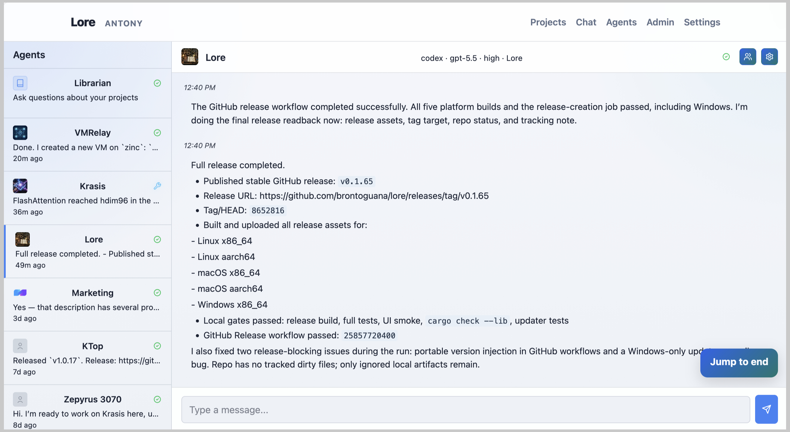

# Lore



Lore is a self-hosted project memory and agent workspace for people who want their projects to stay understandable over time.

It gives each project a durable place for notes, decisions, docs, history, and AI-agent context. Humans use Lore through a browser UI. Agents connect through the CLI or MCP so they can read the same project memory, update documents, and work with the same context you do.

## Why Lore

Most projects scatter their memory across chats, issues, local notes, release logs, and whatever an agent happened to see in one session. Lore puts that working context in one place.

With Lore you can:

- Keep project notes as ordered, typed blocks instead of one giant document
- Ask a project librarian questions about your docs and project history
- Chat with local or remote agents that already know the project context
- Record decisions, debugging notes, changelog entries, and release history
- Review reversible document history instead of losing track of edits
- Link directly to documents and individual blocks with `lore://` links
- Export project content into Git when you want a plain-file archive
- Self-host the whole system on your own machine or server

## For General Users

Lore is built to be a calm place to manage project knowledge.

Use it as a living notebook for anything that benefits from continuity: software projects, infrastructure, writing, research, operations, personal systems, or team knowledge. You can browse documents, reorder blocks, ask the librarian what changed, and keep multiple agents attached to different projects without losing the thread.

The browser UI includes project documents, chat, agents, admin settings, account settings, history views, and setup pages. You do not need to use Git or the CLI for day-to-day reading and editing.

## For Developers

Lore is also built for agent-heavy development workflows.

Developers can use Lore to give coding agents durable project context without pasting the same instructions into every chat. The CLI and MCP access let agents inspect project docs, read and edit blocks, search content, update changelogs, and follow the same project conventions as the human operator.

Useful developer-facing features include:

- Project-scoped agent context and setup instructions
- Local machine agents backed by Claude, Codex, Gemini, or compatible CLI backends
- Agent tokens with scoped project access
- Audit trails for auth, librarian activity, and project actions
- Optional GitHub-release-backed self-update for the CLI and server
- Direct binary installs for Linux, macOS, and Windows

## How It Works

Lore stores project knowledge as documents made from typed blocks. Blocks can be markdown, HTML, SVG, image, or other supported content types. That structure makes it easier for people and agents to read, update, reorder, diff, and revert small pieces of knowledge instead of rewriting whole files.

Each project can have:

- An overview for humans and agents
- A file map for actionable development files
- Agent context for project-specific instructions
- Documents with block-level history
- Searchable content and librarian answers

## Server Install

Install the server management binary:

```sh
curl -fsSL https://raw.githubusercontent.com/brontoguana/lore/main/scripts/install-server.sh | sh
```

Run the full setup:

```sh
lore-server install
```

This will:

1. Create an admin account with an interactive prompt
2. Ask for your domain name
3. Download and configure Caddy as an HTTPS reverse proxy
4. Start Lore and Caddy as systemd daemons
5. Install a tightly scoped sudoers rule so future `lore-server update` runs can restart Lore and Caddy without prompting

Then open `https://yourdomain.com/setup` for browser and agent setup instructions.

If the machine already has a Caddy service that should keep owning ports 80 and 443, install Lore without the bundled Caddy service:

```sh
lore-server install --domain lore.example.com --no-caddy
```

This installs only `lore-server` on the local bind address and prints the Caddy `reverse_proxy` site block to add to your existing Caddyfile.

Other server commands:

```sh
lore-server status       # check if everything is running
lore-server update       # update to the latest release
lore-server uninstall    # remove services, keep data
lore-server clean        # remove services and binaries, keep data
```

Docker is not the primary install path today. Lore prioritizes direct binary installation and simple self-hosting.

## Agent Setup

After the server is installed, open:

```text
https://yourdomain.com/setup
```

The setup page gives you the CLI install command, token configuration, and agent instructions for the server you just installed. Agents can also connect through MCP where supported.

Inside Lore, use the Agents page to create and manage project agents, assign folders, choose backends, and monitor their status.

## Personal BOX Deploy

For the personal BOX host, run the first-install host bootstrap once on the box:

```sh
sudo /usr/local/sbin/install-lore-first.sh
```

That creates the `lore` service user, directories, `lore-server.service`, and restart sudoers rule without touching the existing system Caddy service. After that, use the dedicated quick deploy path from this repo:

```sh
scripts/quick-deploy-personal.sh
```

The deploy script builds and tests the same way as `scripts/quick-deploy.sh`, then uploads or updates `lore-server` on `lore.armino.me` behind the existing system Caddy service.

## Build Locally

Run the test suite:

```sh
cargo test -q
```

Run the binaries:

```sh
cargo run --bin lore-server
cargo run --bin lore -- --help
```

## Releases

Stable releases are published on GitHub with binaries for Linux, macOS, and Windows:

```text
https://github.com/brontoguana/lore/releases
```
